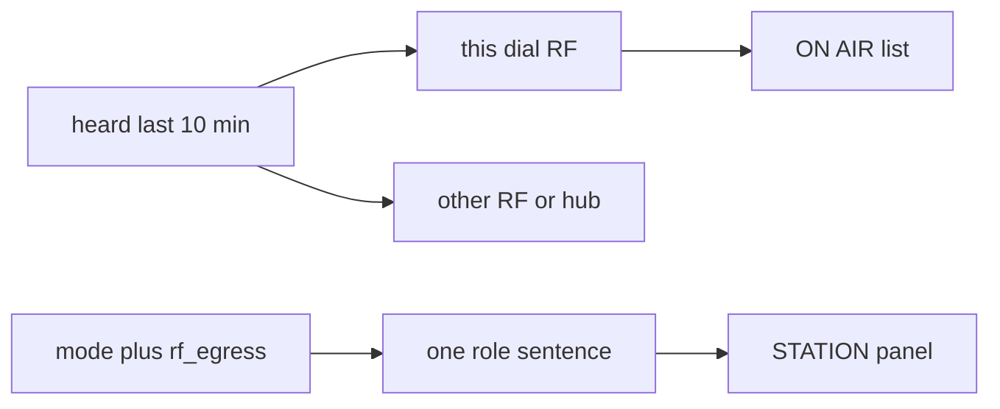

# On-air presence and gateway role

Live Chat’s radio path stays frozen (`air.rs`, `send_chat`, `frag`, presets, modem rungs). This is status and UI only.

Data is already there. [`refresh_heard`](crates/wcr/src/node.rs) fills [`StatusSnapshot.heard`](crates/wcr/src/status.rs) for the last 10 minutes (`callsign`, `medium`, `freq_khz`, `band`, `snr`, `gateway`, `last_heard`). Gateway policy is already [`may_rf_egress`](crates/wcr/src/relay.rs) / [`may_inet_forward`](crates/wcr/src/relay.rs) and [docs/BRIDGING.md](docs/BRIDGING.md). The GUI buries a mixed nick list in the channel column ([`gui.rs`](crates/wcr/src/gui.rs) around the stations block) and falls back to every station when the room filter is empty. The TUI `HEARD` panel does the same mix ([`tui.rs`](crates/wcr/src/tui.rs) `tagged_heard`).

## Do not code until these are answered

The question tool was not available in the cloud session that wrote this plan. On a local session, ask these with the question tool and write the chosen option under each question before editing Rust.

`HeardBrief.gateway` is not “this station bridges.” [`relay.rs`](crates/wcr/src/relay.rs) `on_rx` passes `env.kind == MsgType::Beacon` into that column, and the next non-beacon frame sets it back to false. Beacon bodies are `B|<mode>|<khz>` ([`band::beacon_khz`](crates/wcr/src/band.rs)), but `heard_touch` is called with `mode: None`, so the other station’s mode is not stored.

1. **Clicking a station in ON AIR.** Display only, or a click opens a 1:1 chat with that callsign?
2. **Dial not set, but RF frames are arriving.** Still list those stations, marked as an unknown dial, or show an empty on-dial list until the frequency is set?
3. **Other gateways.** Remember the mode from their last beacon and then name real gateways on this dial, or only describe this station’s role and do not label anyone else as a gateway?
4. **Link down or no audio, but someone was heard minutes ago.** Keep the list with the fault as a line above it, or replace the list with the fault until the radio is healthy?
5. **Channel column when nobody in that room was heard.** Leave the room list empty (ON AIR is the station directory), or keep showing every heard station in the room column?
6. **ON AIR while the mode is internet.** Hide it, or leave it visible with “no radio on this station”?
7. **How a station looks inside the 10 minute window.** One list with an age (`12s`, `4m`), or bright if heard in the last 2 minutes and dimmer after that, still with an age?
8. **Stations on the hub or on another band.** One line with a count, or a second list you can open?
9. **`rf_egress` and guest forwarding in this panel.** Text only (show the live rules, no new switches), or add switches in this same panel?

## 1. On this dial

Draft, subject to the answers above. Add a small pure helper (new functions on [`status.rs`](crates/wcr/src/status.rs), no I/O):

- **On dial:** `medium == "rf"` and `freq_khz` matches this station’s dial. What to do when the dial is unknown is question 2.
- **Elsewhere:** other RF bands, then `inet` / `lan`. How to show them is question 8.
- Row text: callsign, band, age (`12s` / `4m`), SNR when set. A `gw` mark only if question 3 chooses remembering beacon mode. Do not use the current `gateway` column as that mark.
- Empty on-dial copy, so a quiet radio is obvious before a later live test. Whether a fault replaces the list is question 4. Draft lines:
  - TNC set and `tnc_ok == false` → radio link down
  - `audio_label == "no audio"` → no capture
  - otherwise → no station on this dial in 10 min
- Stamp `last_decode` (unix seconds) on the snapshot in the two places that already mark RX: modem control loop in [`node.rs`](crates/wcr/src/node.rs) (next to `s.snr = frame.snr`) and the TNC read loop in [`tnc/link.rs`](crates/wcr/src/tnc/link.rs) (where `s.channel = "rx"`). Do not touch `send_chat`, `pace_and_send`, or the air queue. Show “last decode 4m” or “no decode yet” above the list.

**GUI (draft):** new `ON AIR` block in the left station panel, under the meters, above the cheat sheet. Click behaviour is question 1. In the channel column, the current fallback to every heard station stays or goes based on question 5.

**TUI (draft):** `HEARD` becomes this-dial rows (same formatter). `NICKS` follows the same room-list answer as the GUI.

## 3. Gateway role in the station UI

Put `rf_egress` and `third_party` on the snapshot when status is refreshed from config (read-only; relay behaviour unchanged, unless question 9 adds switches). One sentence under MODE, built by a pure function of mode + those flags + on-dial count:

- **internet-radio:** gateway on `{freq} {band}`. Keys hub traffic onto this dial only for stations heard here in 10 min (`N` now). Uploads RF chat that allows internet. Guests on air only if `third_party = allow`. Tower stays the existing switch.
- **radio-plus:** this station does not upload. A gateway that has heard you on this dial may. Naming those gateways depends on question 3.
- **radio:** radio only; chat is not sent to the hub.
- **internet:** no radio bridge from this station. Whether ON AIR is hidden is question 6.

Same sentence in the TUI station block (one `role` row; wrap if needed).

## Tests

Unit tests for the partition, age text, empty-state copy, and the four role sentences (including `rf_egress` off and guest deny). Do not change Live Chat tests or [`mail/drift.sha256`](crates/wcr/src/mail/drift.sha256). No version bump.

You do the two-station radio check later. These tests only prove the labels match the rules already in `relay.rs`.
