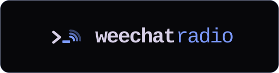

<p align="center">
  <a href="https://weechatradio.com">
    
  </a>
</p>

<p align="center"><strong>Chat that keeps working when the internet does not.</strong></p>

<p align="center">
  <a href="https://www.rust-lang.org/"></a>
  <a href="LICENSE"></a>
  
  
  <br/>
  <a href="https://weechat.org/"></a>
  <a href="https://github.com/RFnexus/modem73"></a>
  
  
  <a href="https://weechatradio.com"></a>
</p>

## What is this?

A small program (`wcr`) that talks to [WeeChat](https://weechat.org/) like an IRC server, and talks to [modem73](https://github.com/RFnexus/modem73) like a TNC. You can use the internet, HF/VHF radio, or both. Messages store-and-forward so nobody has to leave a radio on all night.

With WeeChat Radio you can:

1. Chat from the desktop app (`wcr gui`), a terminal UI (`wcr tui`), or WeeChat
2. Run internet-only, radio-only, or both at once
3. Store and forward messages so stations catch up later
4. Appear on the public map: [weechatradio.com](https://weechatradio.com)

The site, desktop app, TUI, and CLI share one dark terminal shell: indigo `#7d9bff` prompts, orange accents, and the chevron-and-waves mark. The mark recolours with the live station mode (cyan / green / amber / magenta). Change the TUI with `/radio theme hacker` or `/radio theme terminal`.

**You do not need a radio** to try internet mode.
**You do not need WeeChat** — the desktop app or TUI is enough.

WeeChat is a trademark of Sébastien Helleu. This project is independent.

> Early software — it works, but things may still change.

---

## Quick start

Best way to get the **latest** version: install from [weechatradio.com](https://weechatradio.com).

### Linux / macOS

```bash
curl -fsSL https://weechatradio.com/install.sh | sh
wcr setup
wcr gui
```

Prefer a terminal? `wcr tui` is the same station.

### Windows (PowerShell)

```powershell
irm https://weechatradio.com/install.ps1 | iex
```

Open **WeeChat Radio** from the Start menu. First launch is setup; then you chat in the window.

```powershell
# optional, same window from a terminal:
wcr gui
```

How you know it worked: the status bar shows your callsign. Send a line in `#bulletin`. A `✓` means it went out.

Radio guides: [VR-N76 / UV-PRO over Bluetooth](https://weechatradio.com/guides/vr-n76.html) · [handheld + Digirig](https://weechatradio.com/guides/handheld.html) · [VOX cable](https://weechatradio.com/guides/vox.html) · [HF + CAT](https://weechatradio.com/guides/hf.html)

---

## Modes

Switch with `/radio mode <name>` or `F2` in the TUI. The mark and tray icon follow the mode.

| | Command | What it does |
|---|---------|----------------|
|  | `/radio mode internet` | Internet only |
|  | `/radio mode internet-radio` | Radio first, internet fills gaps (gateway) |
|  | `/radio mode radio` | Radio only — never uses the internet |
|  | `/radio mode radio-plus` | Radio only, but a gateway may forward you |

If the hub dies, radio keeps working. The bar says **Internet down, radio only**.

Full table: [modes](https://weechatradio.com/docs/modes.html)

---

## Radio

You need a valid licence, a radio, and audio into the PC. [modem73](https://github.com/RFnexus/modem73) is the TNC. Windows and Linux installers put it next to `wcr`. Common paths:

| Path | What you need |
|------|----------------|
| VR-N76 / UV-PRO (Bluetooth) | Vero VR-N76, BTECH UV-PRO or Radioddity GA-5WB — built-in KISS TNC, no cable; the app pairs and connects (`wcr tnc find`) |
| KISS TNC on a serial port | Mobilinkd, `/dev/rfcomm0`, or any KISS TNC on a COM port |
| Handheld + Digirig | VHF/UHF HT and a [Digirig](https://digirig.net/) (or AIOC) USB cable |
| VOX cable | Any radio that keys on VOX, plus a 3.5 mm audio cable |
| HF + CAT | HF rig with `rigctl` (Hamlib) for PTT and frequency |

Run `wcr setup` and pick the path that matches your station. Suggested calling frequencies: [calling](https://weechatradio.com/docs/calling.html). You are the control operator — check your band plan before you transmit.

---

## Using WeeChat

The official installer installs WeeChat and points it at the local node.

```
wcr setup
wcr node
wcr weechat
```

`wcr weechat --configure` rewrites the `radio` server (`127.0.0.1:6667`) and loads [`weechat/radio.py`](weechat/radio.py). The built-in UI is still `wcr gui` or `wcr tui`.

Step-by-step: [WeeChat guide](https://weechatradio.com/guides/weechat.html)

---

## Mini glossary

| Word | Meaning |
|------|---------|
| **`wcr`** | The WeeChat Radio program (node, hub, desktop app, and TUI) |
| **Callsign** | Your amateur radio ID, or a guest name starting with `~` |
| **Grid** | Short location code for the map (Maidenhead) |
| **Hub** | Public internet rendezvous at `hub.weechatradio.com` |
| **TNC** | The box (here: modem73) that turns data into radio audio |
| **Store-and-forward** | Messages wait on disk until the next station can take them |

---

## Helpful links

- Live map + hub: [weechatradio.com](https://weechatradio.com)
- Changelog: [changelog](https://weechatradio.com/changelog.html)
- 5-minute start: [guides/start](https://weechatradio.com/guides/start.html)
- Radio setup: [guides/radio](https://weechatradio.com/guides/radio.html)
- Protocol: [docs/protocol](https://weechatradio.com/docs/protocol.html)
- Public API: [docs/api](https://weechatradio.com/docs/api.html)
- Licence: [Apache-2.0](LICENSE) (WeeChat script is [GPL-3.0-or-later](weechat/LICENSE))

---

## Build from source

```bash
git clone https://github.com/thaum-labs/weechat-radio.git
cd weechat-radio
cargo install --path crates/wcr
wcr setup
wcr gui
```

You need a Rust toolchain (1.80 or newer). On Windows, the MSVC build tools are required for the bundled SQLite. `--no-default-features` skips the desktop GUI if you only want the TUI.

---

## For developers

<details>
<summary>Click to expand</summary>

```
crates/wcr/     node daemon, hub, desktop GUI, TUI, modem73 client, local IRC server
weechat/        WeeChat helper script (GPL-3.0-or-later)
web/            official site source (weechatradio.com)
web/icons/      brand mark and per-mode icons
docs/           operator guides
install/        install.sh, install.ps1, Homebrew / Scoop / WinGet stubs
deploy/         DigitalOcean droplet, Caddy, Docker Compose
branding/       README lockup and app icon (accent mark)
```

```bash
cargo test --workspace
python web/icons/render.py   # regenerate PNG/ICO marks
```

The same `wcr` binary is a station (`wcr node` / `wcr gui` / `wcr tui`) or the public hub (`wcr hub`). Hub deploy notes: [deploy](https://weechatradio.com/docs/deploy.html).

</details>

---

## Licence

Apache-2.0 for the daemon, hub, and website. The WeeChat script `weechat/radio.py` is GPL-3.0-or-later (it runs inside WeeChat).

See [`LICENSE`](LICENSE), [`NOTICE`](NOTICE), and [`weechat/LICENSE`](weechat/LICENSE).

---

Created by **Thaum Labs**

**WeeChat Radio** — chat that keeps working when the internet does not
