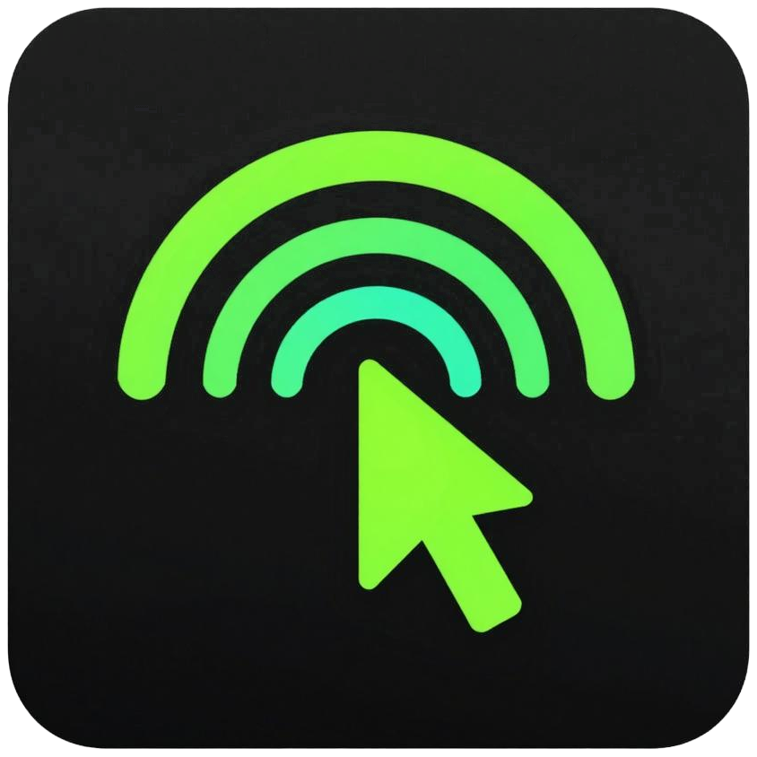

<p align="center">
  
</p>

<h1 align="center">WeeChat Radio</h1>
<p align="center"><strong>Chat that keeps working when the internet does not.</strong></p>

<p align="center">
  <a href="https://www.rust-lang.org/"></a>
  <a href="LICENSE"></a>
  
  
  <br/>
  <a href="https://weechat.org/"></a>
  <a href="https://github.com/RFnexus/modem73"></a>
  
  
  <a href="https://weechatradio.com"></a>
</p>

## What is this?

A small program (`wcr`) that talks to [WeeChat](https://weechat.org/) like an IRC server, and talks to [modem73](https://github.com/RFnexus/modem73) like a TNC. You can use the internet, HF/VHF radio, or both. Messages store-and-forward so nobody has to leave a radio on all night.

With WeeChat Radio you can:

1. Chat from a built-in terminal UI (`wcr tui`) or from WeeChat
2. Run internet-only, radio-only, or both at once
3. Store and forward messages so stations catch up later
4. Appear on the public map: [weechatradio.com](https://weechatradio.com)

**You do not need a radio** to try internet mode.  
**You do not need WeeChat** — the TUI is enough.

WeeChat is a trademark of Sébastien Helleu. This project is independent.

> Early software — it works, but things may still change.

---

## Quick start

Best way to get the **latest** version: install from [weechatradio.com](https://weechatradio.com).

### Linux / macOS

```bash
curl -fsSL https://weechatradio.com/install.sh | sh
wcr setup
wcr tui
```

### Windows (PowerShell)

```powershell
irm https://weechatradio.com/install.ps1 | iex
wcr setup
wcr tui
```

How you know it worked: the status bar shows your callsign. Send a line in `#bulletin`. A `✓` means it went out.

Radio guides: [handheld + Digirig](docs/RADIO-SETUP.md) · [VOX cable](docs/RADIO-SETUP.md) · [HF + CAT](docs/RADIO-SETUP.md)

---

## Modes

Switch with `/radio mode <name>` or `F2` in the TUI.

| Command | What it does |
|---------|----------------|
| `/radio mode internet` | Internet only |
| `/radio mode internet-radio` | Radio first, internet fills gaps (gateway) |
| `/radio mode radio` | Radio only — never uses the internet |
| `/radio mode radio-plus` | Radio only, but a gateway may forward you |

If the hub dies, radio keeps working. The bar says **Internet down, radio only**.

Full table: [docs/MODES.md](docs/MODES.md)

---

## Radio

You need a valid licence, a radio, and audio into the PC. [modem73](https://github.com/RFnexus/modem73) is the TNC. Three common paths:

| Path | What you need |
|------|----------------|
| Handheld + Digirig | VHF/UHF HT and a [Digirig](https://digirig.net/) (or AIOC) USB cable |
| VOX cable | Any radio that keys on VOX, plus a 3.5 mm audio cable |
| HF + CAT | HF rig with `rigctl` (Hamlib) for PTT and frequency |

Run `wcr setup` and pick the path that matches your station. Suggested calling frequencies: [docs/CALLING.md](docs/CALLING.md). You are the control operator — check your band plan before you transmit.

---

## Using WeeChat

The TUI is enough for a station. WeeChat is the full client.

1. Start `wcr tui` or `wcr node` on this computer
2. Copy [`weechat/radio.py`](weechat/radio.py) into WeeChat's Python directory
3. In WeeChat:

```
/server add radio 127.0.0.1/6667 -autoconnect
/connect radio
/script load radio.py
```

You land in `#bulletin`. `/radio help` lists node commands.

Step-by-step: [weechat/setup.md](weechat/setup.md)

---

## Mini glossary

| Word | Meaning |
|------|---------|
| **`wcr`** | The WeeChat Radio program (node, hub, and TUI) |
| **Callsign** | Your amateur radio ID, or a guest name starting with `~` |
| **Grid** | Short location code for the map (Maidenhead) |
| **Hub** | Public internet rendezvous at `hub.weechatradio.com` |
| **TNC** | The box (here: modem73) that turns data into radio audio |
| **Store-and-forward** | Messages wait on disk until the next station can take them |

---

## Helpful links

- Live map + hub: [weechatradio.com](https://weechatradio.com)
- 5-minute start: [docs/QUICKSTART.md](docs/QUICKSTART.md)
- Radio setup: [docs/RADIO-SETUP.md](docs/RADIO-SETUP.md)
- Protocol: [docs/PROTOCOL.md](docs/PROTOCOL.md)
- Public API: [docs/API.md](docs/API.md)
- Licence: [Apache-2.0](LICENSE) (WeeChat script is [GPL-3.0-or-later](weechat/LICENSE))

---

## Build from source

```bash
git clone https://github.com/thaum-labs/weechat-radio.git
cd weechat-radio
cargo install --path crates/wcr
wcr setup
wcr tui
```

You need a Rust toolchain (1.80 or newer). On Windows, the MSVC build tools are required for the bundled SQLite.

---

## For developers

<details>
<summary>Click to expand</summary>

```
crates/wcr/     node daemon, hub, TUI, modem73 client, local IRC server
weechat/        WeeChat helper script (GPL-3.0-or-later)
web/            official site source (weechatradio.com)
docs/           operator guides
install/        install.sh, install.ps1, Homebrew / Scoop / WinGet stubs
deploy/         DigitalOcean droplet, Caddy, Docker Compose
branding/       logo used on the site and in this README
```

```bash
cargo test --workspace
```

The same `wcr` binary is a station (`wcr node` / `wcr tui`) or the public hub (`wcr hub`). Hub deploy notes: [docs/DEPLOY.md](docs/DEPLOY.md).

</details>

---

## Licence

Apache-2.0 for the daemon, hub, and website. The WeeChat script `weechat/radio.py` is GPL-3.0-or-later (it runs inside WeeChat).

See [`LICENSE`](LICENSE), [`NOTICE`](NOTICE), and [`weechat/LICENSE`](weechat/LICENSE).

---

Created by **Thaum Labs**

**WeeChat Radio** — chat that keeps working when the internet does not
